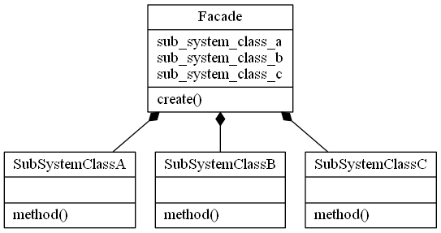
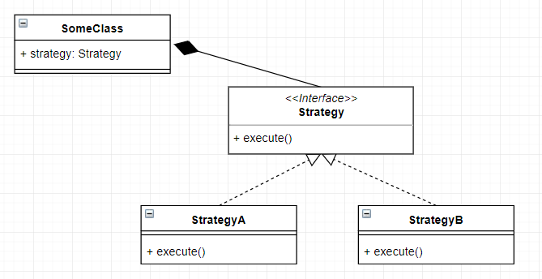
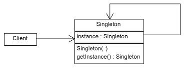
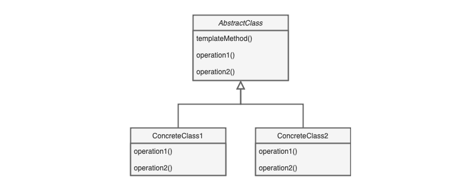

<h2>
 &nbsp &nbsp <strong> and Design Patterns :heavy_check_mark:</strong>
 </h2>

    

        This project was created to learn and practice concepts about <strong>Typescript</strong>.
        It is a powerfull superset of javascript, created by Microsoft, it can be used in back-end or front-end projects. Other feature, or specifically, programming paradigm, is the Oriented Object Programming (OOP).
        <strong>Design Patterns</strong> are solutions used to commom problems in a software project . There are three categories of design patterns: Creational patterns, creates objects to provide flexibility and reusable code; Structural patterns, show and explains how use classes and objects in a large structure, keeping flexibility; Behavioral patterns, attends to communication and responsabilities between objects.
    

     

    

        To run the project :electric_plug:
    

    

        you need to install dependencies with `yarn` or `npm install`
    

 

    Facade

        - Structural Pattern;
        - Show how mount objects and classes in big projects;
        - Is an object that serves as a front-facing interface;
        - Mask complex implementations or structural code.

    To see this pattern working, run:  `yarn facade` or `npm run facade`

    <h3>Example :pushpin:</h3> 
        
      
     <h3>Illustration</h3>
        
    

 

    Strategy

        - Behavioral Pattern;
        - Defines a family of algorithms;
        - Encapsulates each algorithm as a class;
        - Makes Liskov Substitution Principle easily to implementation;

    To see this pattern working, run:  `yarn strategy` or `npm run strategy`

    <h3>Example :pushpin:</h3>
        
      
    <h3>Illustration</h3>
        
    

 

    Singleton

        - Creational Pattern;
        - Provides only one instance of class;
        - Usually have a global instance;

    To see this pattern working, run:  `yarn singleton` or `npm run singleton`

    <h3>Example :pushpin:</h3>
        
      
    <h3>Illustration</h3>
        
    

 

    Observer

        - Behavioral Pattern;
        - Defines dependencies one-to-many;
        - When an object changes, all dependencies are notified and updated.

      To see this pattern working, run:  `yarn observer` or `npm run observer`

    <h3>Example :pushpin:</h3>
        
      
    <h3>Illustration</h3>
        
    

 

    Template Method

        - Behavioral Pattern;
        - Breaks algorithm in steps methods;
        - One standard method call the steps;

      To see this pattern working, run:  `yarn templateMethod` or `npm run templateMethod`

    <h3>Example :pushpin:</h3>
        
      
    <h3>Illustration</h3>
       
    

 

    

        To see more, follow the documentation: https://www.typescriptlang.org/docs/handbook/intro.html
    

